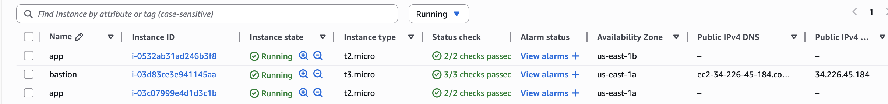
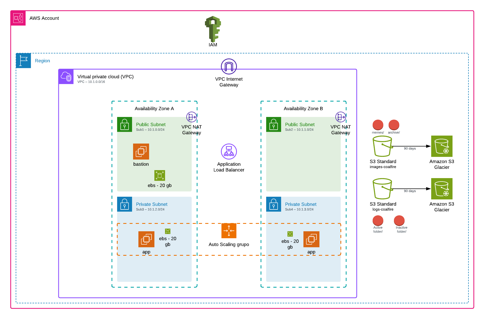

# AWS Infrastructure Deployment Challenge (Coalfire)

This repository contains the Terraform code and documentation for deploying a secure, modular, and scalable AWS environment based on the **Coalfire AWS Technical Challenge (July 2025)**.

---

## Security Architecture

## ✅ Solution Overview


This solution provisions the following infrastructure in compliance with the challenge:

- **Custom VPC** (10.1.0.0/16) with 4 subnets across 2 AZs:
  - Sub1 & Sub2: Public
  - Sub3 & Sub4: Private
- **Bastion Host** in Subnet 2 for SSH access
- **Auto Scaling Group (ASG)** in private subnets (Sub3 & Sub4):
  - EC2s (RHEL) with Apache (`httpd`) installed via user data
  - Min 2, Max 6, instance type: t2.micro
- **Application Load Balancer (ALB)**:
  - Listener on HTTP 80, forwards to ASG instances on port 443
- **IAM Roles & Instance Profiles**:
  - ASG instances: Read from `images` bucket, write to `logs` bucket
- **S3 Buckets**:
  - `images-coalfire`: with `archive/` folder, `memes/` → Glacier after 90 days
  - `logs-coalfire`: with `active/` (→ Glacier after 90d) and `inactive/` (→ delete after 90d)
- **KMS Encryption** for all S3 operations 

---

## 🚀 Deployment Instructions

### Prerequisites

- AWS CLI configured
- Terraform v1.5.4+
- Region: `us-east-1`

### 1. Clone the repository and configure variables

```bash
git clone https://github.com/deca-sight/gl-interview-exercise2
cd gl-interview-exercise2
```

Edit `terraform.tfvars` or provide CLI vars.

### 2. Deploy Infrastructure

```bash
terraform init
terraform plan
terraform apply
```

### 3. Validate Deployment

- EC2s in ASG launched in subnets 3 & 4
- ALB accessible via HTTP (port 80)
- `httpd` running on instances (port 443)
- S3 buckets created with lifecycle rules
- IAM roles attached and functioning (read/write test)

## SSH Access Instructions

To connect securely to a private instance via the Bastion Host:

```bash
ssh -i generated_keys/cloud-engineer-key.pem \
    -o "IdentitiesOnly=yes" \
    -o "ProxyCommand=ssh -i generated_keys/cloud-engineer-key.pem -o IdentitiesOnly=yes -W %h:%p ec2-user@<bastion-public-ip>" \
    ec2-user@<private-instance-ip>
```

Replace `<bastion-public-ip>` and `<private-instance-ip>` with the appropriate values. The `generated_keys/` folder contains the key pair provisioned via Terraform.

---

## 📐 Design Decisions and Assumptions

- Used **public Terraform modules** from Coalfire and community (CloudPosse, terraform-aws-modules)
- All resources are managed via Terraform – no manual steps
- ALB forwards plain HTTP to EC2 over 443; no TLS termination at ALB assumed
- KMS key created and reused for both buckets
- Security Groups were tightly scoped (least privilege)
- EC2 user data is externalized
- No domain or Route 53 DNS integration

---

## 📚 References to Resources Used

### Terraform Modules

- [cloudposse/ec2-autoscale-group](https://registry.terraform.io/modules/cloudposse/ec2-autoscale-group/aws)
- [terraform-aws-modules/alb/aws](https://registry.terraform.io/modules/terraform-aws-modules/alb/aws)
- [Coalfire-CF/terraform-aws-s3](https://github.com/Coalfire-CF/terraform-aws-s3)
- [Coalfire-CF/terraform-aws-securitygroup](https://github.com/Coalfire-CF/terraform-aws-securitygroup)
- [terraform-aws-modules/iam/aws](https://registry.terraform.io/modules/terraform-aws-modules/iam/aws)
- [terraform-aws-modules/vpc/aws](https://registry.terraform.io/modules/terraform-aws-modules/vpc/aws)

---

## 🤔 Assumptions Made

- NAT Gateways are available for private subnets to install packages
- No TLS cert was required (as ALB forwards HTTP to EC2 443)
- `images` and `logs` buckets are private and encrypted
- No serverless or event-driven services required (e.g., Lambda, CW alarms)
- Only basic Apache service was needed; no app code or database required

---

## 🛠️ Improvement Plan with Priorities 

Note: Improvements are classified not only by technical priority or impact, but also by implementation simplicity. Tasks that deliver high value with low effort are prioritized, enabling the infrastructure to evolve incrementally and effectively.

### 🔺 High Priority

- Replace Bastion with **SSM Session Manager** as default connection method
- Use **Spot Instances** for Bastion and ASG to optimize cost
- Enable **TLS termination at ALB** using ACM – HTTPS end-to-end
- Add **VPC Endpoints** for S3, SSM
- Store private key (`.pem`) securely in **Parameter Store** or **Secrets Manager**
- Improve **health checks** for ALB & ASG (grace period, thresholds)
- Allow ASG EC2 instances to tag themselves (e.g., `web-<instance_id>`) via User Data or a Lambda
- Improve tag propagation and consistency across all resources
- Enable ALB **access logging** to encrypted S3 bucket
- Validate and tune **ASG scale-in/out thresholds**
- Add CI/CD workflow (e.g., GitHub Actions)

### 🟠 Medium Priority

- Modularize infrastructure further (e.g., `web_server`, `bastion`, `network` wrappers)
- Integrate **CloudWatch dashboards and alarms**
- Externalize AMI creation with **Packer + Ansible**

### 🟢 Low Priority

- Centralized **Secrets Manager** for app configs
- Consider **WAF** for ALB protection
- Investigate future **migration to ECS** for containerization
- AWS backups, Cloudwatch agent, Inspector, etc.

---

## 🔍 Analysis of Operational Gaps

- No EBS snapshot or AMI backup strategy
- No drift detection (e.g., AWS Config)
- IAM roles functional but could use inline condition scoping
- Slack notifications/log parsing was excluded for scoping

---

## 📸 Evidence of Successful Deployment



```
terraform apply
Apply complete! Resources: 69 added, 0 changed, 0 destroyed.
```

---

## 🖼️ Solutions Diagram



- Includes VPC, Subnets, NAT Gateway, ALB, ASG, EC2s
- Shows S3 Buckets, IAM roles
- Visualizes ALB → ASG → EC2 → S3 write flow

---

## 🧩 Challenges and Design Dilemmas

### 1. Wrapper Modules vs. Direct Usage

I considered creating custom wrapper modules for each resource (like I did with VPC). However, due to time constraints, I opted to use well-maintained public modules directly. This allowed me to focus on infrastructure logic and correctness instead of boilerplate abstraction.

### 2. Cloud-init Linting for ASG EC2s

The `user_data` passed to the ASG often failed due to YAML-sensitive characters or formatting issues. Multiple iterations were needed to pass both `cloud-init` and `Terraform` validation.

### 3. IAM Role MFA Condition

The IAM role I initially used included an MFA condition, which blocked EC2 from assuming the role via instance profile. This required a revision to the trust policy to remove MFA or conditionally scope it for human users only.

These areas required additional time and debugging beyond the expected scope.

---

## 📎 Notes

- Region used: `us-east-1`
- Generated_keys/: Stores the PEM key pair created via Terraform for Bastion/EC2 access.
- Tested in July 2025 using Terraform 1.5.4
- Diagram follows AWS standards and icons
